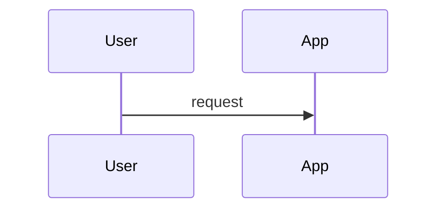

# To SDD

把已明确的需求转成可实现、可 review、可拆 issue 的 Software Design Document。

适用阶段：**PRD 之后，`to-issues` 之前**。如果还没有 PRD，也可以从当前对话和代码库生成，但必须标出假设。

## 原则

- 能从代码、PRD、`CONTEXT.md`、`docs/adr/` 推断的，不问用户。
- 只追问会影响设计方向的高风险未知项；一次只问一个问题，并给推荐答案。
- 输出是软件设计，不是任务拆解；任务拆解交给 `to-issues`。
- 架构决策尊重已有 ADR；冲突时明确指出，不悄悄覆盖。
- 使用项目领域词汇；新领域术语需要先沉淀到 `CONTEXT.md`。
- 只有满足 ADR 条件的长期决策，才建议新增 ADR。

## 流程

### 1. 收集上下文

优先使用当前对话。然后按需读取：

- PRD、issue、spec 或用户给出的文档。
- `CONTEXT.md` 或 `CONTEXT-MAP.md`。
- `docs/adr/` 中相关 ADR。
- 代码中的现有 module、interface、schema、API、job、event、配置和部署入口。
- 现有 `docs/design/` 中的 SDD。

如果仓库还没初始化领域文档，先运行或建议 `setup-matt-pocock-skills`。

### 2. 判断是否需要追问

只有这些问题值得追问：

- 关键非功能目标不明确：一致性、延迟、吞吐、可用性、合规、安全、成本。
- 数据所有权或 bounded context 不清。
- 外部系统 contract 不清。
- 有多个合理设计方向，且选择后返工成本高。
- 已有 ADR 与当前需求冲突。

追问格式：

```md
需要先确认一个设计决策：

问题：...
推荐：...
原因：...
```

用户回答后继续；不要一次性列很多问题。

如果用户要求直接生成，用明确的 `Assumptions` 继续。

### 3. 生成或更新 SDD

默认输出 Markdown。除非用户指定路径，否则直接在回复中给出；如果用户要求落库，建议写到 `docs/design/<slug>-sdd.md`。

如果是第一次设计一个较大功能，生成全量 SDD。

如果是后续迭代，优先更新同一份 SDD：

- 保留仍然有效的章节，不重写整篇。
- 只修改被本次迭代影响的章节。
- 在 `修订记录` 追加本次迭代的变更。
- 在 `需求映射` 标出新增、变更或移除的需求。
- 在 `风险与未决问题` 保留仍未解决的问题，关闭已解决项。
- 如果本次迭代引入难逆转决策，建议新增 ADR，而不是只写在 SDD 里。

只有当本次迭代是独立子系统、生命周期独立、或原 SDD 已经太大难维护时，才建议新建子 SDD，并在主 SDD 中链接。

模板：

````md
# 软件设计文档：<名称>

## 修订记录

| 版本 | 日期 | 来源 | 变更摘要 |
| --- | --- | --- | --- |
| v0.1 | YYYY-MM-DD | PRD / issue / conversation | 初版 |

## 背景

需求背景、当前系统状态、相关 PRD / issue / ADR。

## 需求映射

| 需求 | 设计响应 | 状态 |
| --- | --- |
| ... | ... | 新增 / 变更 / 已确认 |

## 目标

- ...

## 非目标

- ...

## 假设

- ...

## 约束

- 领域约束
- 技术约束
- 运行约束
- 已有 ADR 约束

## 系统概览

系统边界、用户/外部系统、主要运行路径。

## 架构设计

整体架构形状。说明主要 module、interface、adapter、seam，以及它们的责任边界。

## 详细设计

关键内部设计：状态机、业务规则、同步/异步边界、缓存、幂等、并发控制、权限检查点。

## 模块设计

| 模块 | 职责 | 接口 | 实现说明 |
| --- | --- | --- | --- |
| ... | ... | ... | ... |

## 数据设计

- 主要实体 / schema。
- 数据所有权。
- 读写路径。
- 迁移策略。

## API / 事件契约

- HTTP / RPC / CLI / event / job contract。
- 请求、响应、错误语义。
- 兼容性要求。

## 流程

用 Mermaid 表达关键流程、状态流或数据流；没有图比乱图好。



## 运行时架构

- 部署单元。
- 配置。
- 后台任务。
- 依赖服务。
- 扩缩容或容量假设。

## 可靠性、安全与可观测性

- 错误处理与重试。
- 权限与数据保护。
- 日志、指标、追踪、告警。

## 测试策略

- 哪些 module 需要测试。
- 哪些 contract 需要测试。
- 哪些路径需要端到端验证。
- 不测试哪些实现细节。

## 发布与迁移

- 发布顺序。
- 数据迁移。
- 灰度、回滚、兼容窗口。

## 备选方案

- 方案 A：为什么不用。
- 方案 B：为什么不用。

## 风险与未决问题

- ...

## ADR 候选

- 是否需要 ADR；为什么。

## 实施切片建议

只列建议切片方向，不展开成 issue；详细拆分交给 `to-issues`。
````

### 4. 收尾

结尾询问用户是否要：

- 继续用 `to-issues` 拆成垂直切片。
- 把关键长期决策写成 ADR。
- 把文档保存到 `docs/design/`。

只在用户确认后写文件或发 issue。
